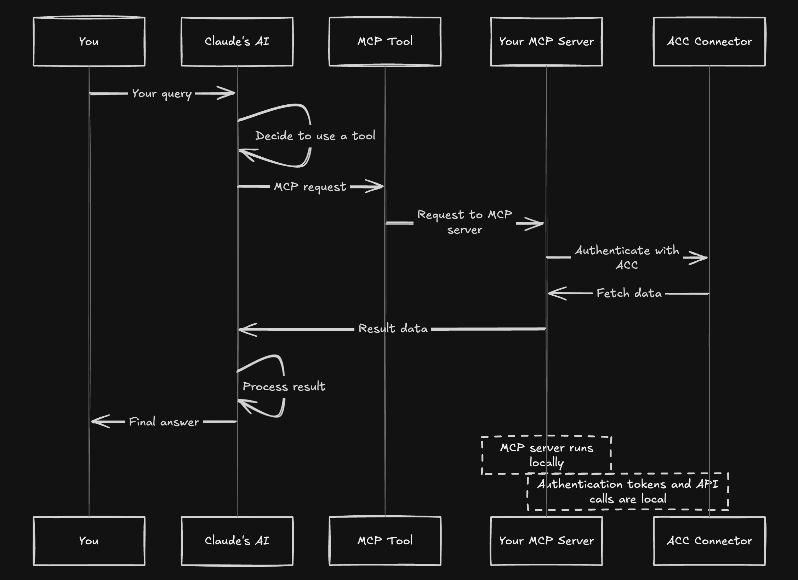

# ACC MCP Integration

A minimal MCP server integrating Autodesk ACC APIs via APS toolkit.

## Setup

### Option 1: Using uv (recommended)

1. Install uv if you don't have it:
   ```
   curl -LsSf https://astral.sh/uv/install.sh | sh
   ```

2. Copy `.env.sample` to `.env` and fill in your credentials:
   ```
   cp .env.sample .env
   ```

3. Create and activate a virtual environment:
   ```
   uv venv
   # On Windows:
   .venv\Scripts\activate
   # On Unix or MacOS:
   source .venv/bin/activate
   ```

4. Install dependencies:
   ```
   uv pip install -r requirements.txt
   ```

5. Run the MCP server:
   ```
   python aps_dm_server.py
   ```

### Option 2: Using pip

1. Copy `.env.sample` to `.env` and fill in your credentials:
   ```
   cp .env.sample .env
   ```

2. Create and activate a virtual environment:
   ```
   python -m venv .venv
   # On Windows:
   .venv\Scripts\activate
   # On Unix or MacOS:
   source .venv/bin/activate
   ```

3. Install dependencies:
   ```
   pip install -r requirements.txt
   ```

4. Run the MCP server:
   ```
   python aps_dm_server.py
   ```

## Integration with Claude Desktop

To use this MCP server with Claude Desktop:

1. Make sure you have Claude Desktop installed (download from [Claude.ai](https://claude.ai/))
2. Open your Claude Desktop configuration file:
   ```
   code ~/Library/Application\ Support/Claude/claude_desktop_config.json
   ```
   Create it if it doesn't exist.

3. Add the appropriate configuration:

   **Option A: Direct Python from virtual environment (most reliable)**
   ```json
   {
       "mcpServers": {
           "acc": {
               "command": "/ABSOLUTE/PATH/TO/YOUR/.venv/bin/python",
               "args": [
                   "/ABSOLUTE/PATH/TO/YOUR/aps_dm_server.py"
               ],
               "env": {
                   "PYTHONPATH": "/ABSOLUTE/PATH/TO/YOUR/PROJECT/FOLDER"
               }
           }
       }
   }
   ```
   Replace paths with absolute paths to your environment and project.

   **Option B: Using uv**
   ```json
   {
       "mcpServers": {
           "acc": {
               "command": "/ABSOLUTE/PATH/TO/uv",
               "args": [
                   "--directory",
                   "/ABSOLUTE/PATH/TO/YOUR/PROJECT/FOLDER",
                   "run",
                   "aps_dm_server.py"
               ]
           }
       }
   }
   ```
   Find the absolute path to `uv` by running `which uv` in your terminal.

4. Save the file and restart Claude Desktop completely
5. Look for the hammer icon in Claude Desktop to access the ACC tools

## macOS Specific Setup

macOS users may encounter permission issues when integrating with Claude Desktop:

1. **Permission Issues**: If you see errors like `Operation not permitted` in logs:
   - Open System Preferences → Privacy & Security → Full Disk Access
   - Add Terminal and Claude applications by clicking the "+" button
   
2. **Working Directory Issues**: If you see errors about current directory not existing:
   - Always use absolute paths in your configuration
   - Consider storing projects in locations with fewer permissions restrictions (e.g., Documents folder)

3. **Finding the correct Python path**: To get the exact path to your virtual environment's Python:
   ```
   source .venv/bin/activate  # Activate your environment first
   which python  # Get the full path
   ```

4. **Checking logs for troubleshooting**:
   ```
   tail -n 50 -f ~/Library/Logs/Claude/mcp*.log
   ```

## Requirements
- Python 3.11 or higher
- Dependencies listed in requirements.txt

## System Architecture

This MCP server acts as a bridge between Claude AI and the Autodesk APS platform. The diagram below illustrates how data flows through the system:



1. Your query to Claude triggers tool selection
2. Claude sends MCP requests to your local server
3. The MCP server connects to APS/ACC using your credentials
4. Data flows back to Claude which processes and formats results

## Available Tools

The MCP server exposes the following tools:

- `get_hubs`: Get all available hubs
- `get_projects`: Get all projects within a hub
- `get_project_files`: Get files in a specific folder of a project
- `get_versions`: Get version information for a specific item

## Troubleshooting

If you encounter issues with Claude Desktop integration:

1. **Server not showing up**: 
   - Check configuration file syntax (valid JSON)
   - Use absolute paths everywhere
   - Restart Claude Desktop completely

2. **Permission errors**:
   - Grant Full Disk Access to Terminal and Claude
   - Try using Python directly rather than through uv
   - Try moving the project to a location with fewer restrictions

3. **Environment errors**:
   - Ensure all dependencies are installed
   - Try using the direct path to Python in your virtual environment
   - Check your `.env` file has correct Autodesk credentials

4. **Logs check**:
   ```
   tail -n 50 -f ~/Library/Logs/Claude/mcp*.log
   ```

5. **Manual testing**:
   Test your server works by running it directly:
   ```
   cd /path/to/your/project
   source .venv/bin/activate
   python aps_dm_server.py
   ```

## Using with OpenAI Agents SDK

This project includes integration with the OpenAI Agents SDK, allowing you to use the MCP server with an OpenAI agent.

1. Make sure your `.env` file includes your OpenAI API key:
   ```
   OPENAI_API_KEY=your_openai_api_key
   ```

2. Install the additional dependencies:
   ```
   uv pip install openai>=1.31.0
   ```

3. Run the agent:
   ```
   python main_agent.py
   ```

This will start an interactive session where you can ask the agent questions about your Autodesk projects.


## Dependencies and Licensing

This project uses the following open source components:

- **[aps-toolkit](https://github.com/chuongmep/aps-toolkit)** - A library for Autodesk Platform Services (GPL-3.0)
- **mcp** - Multimodal Capability Protocol implementation
- **python-dotenv** - Environment variable management
- **openai** and **openai-agents** - OpenAI integration

This project is licensed under the [GNU General Public License v3.0](LICENSE) as required by the aps-toolkit dependency.

## Disclaimer

This software is provided "as is", without warranty of any kind, express or implied. This is a prototype for demonstration purposes only. The author takes no responsibility for any damages or issues that may arise from using this software. Use at your own risk.